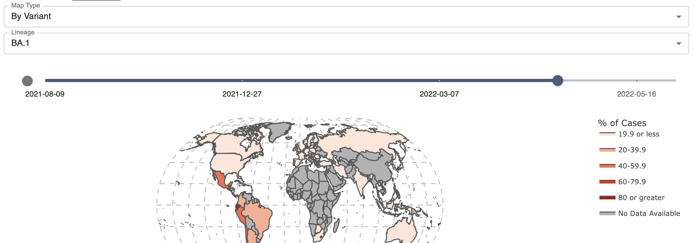
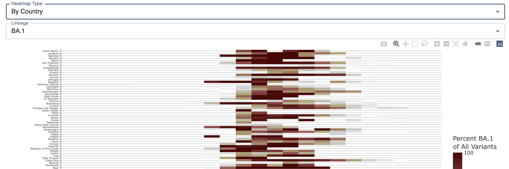

# Shiny Omicron

Shiny omicron provides insights into the evolution of different omicron strains by country over time.

The dashboard is made of three tabs:

- [By-Country](#By-Country)
- [Maps](#Maps)
- [Heatmaps](#Heatmaps)

## By-Country

The **By-Country** tab allows users to select a country of interest and visualize the development of all omicron strains over time.

## Maps

The **Maps** tab can be used to visualize the spread of omicron by dominant variant or by variant in a country of interest.
It provides a date slider to choose a week of interest.

The *by variant* map type displays the dominant variant in each country.
The *by variant* map type allows users to select a variant of interest and view its percentage in each country.
Percentages are binned into quintiles of 0-19.9, 20-39.9, 40-59.9, 60-79.9, and 80-100.

## Heatmaps

The **Heatmaps** tab provides multiple heatmaps to view the spread of omicron variants. The by country heatmap requires users to select a variant of interest. The resulting heatmap shows how the percentage of the specified variant as a part of all variants changes over time in each country. The by variant heatmap shows globally how the percentage of each variant changed over time.